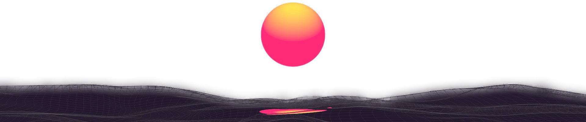

# Hello, I'm Guilherme 

## I am an Information System Graduate - UEA

- 🔎 I like to explore new technologies and develop software solutions and quick hacks.
- 🎓 I'm currently studying Information System at the Universidade do Estado de Amazonas.
- 🌱 I'm on track for learning more about Frontend / Backend development.
- 👾 I'm also looking for new knowledge with game development, since I already have some with Unity and Pygame.
- 😍 In my free time i try playing video games, volleyball and learning new technologies.
- 📫 How to reach me: <a href="mailto:guilherme.lucas.ts@gmail.com">E-mail</a>  [Linkedin](www.linkedin.com/in/guilherme-lucas-teixeira-silva)

---

### 🛠️ Tech Stack

---

